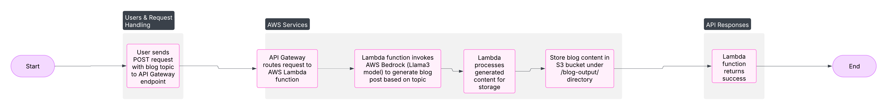

## Blog Generator with AWS Bedrock & Lambda
Used llama 3

This demo learning project generates AI-powered blog posts using Amazon Bedrock's LLMs and stores them in S3 via an AWS Lambda function. It is designed to be lightweight and serverless.

## Architecture


## 🔧 Setup Instructions
### **1️⃣ Prerequisites**
- An AWS account with access to **Bedrock, Lambda, S3, and API Gateway**.
- AWS CLI configured with appropriate permissions.

### **2️⃣ Deploying Manually**
1. **Create an S3 Bucket**:  
aws s3 mb s3://awsbedrockllm

2. **Deploy the Lambda Function**:
- Upload the `main.py` script.
- Configure the runtime as **Python 3.x**.
- Add execution permissions for Bedrock and S3.
3. **Set Up API Gateway**:
- Create an API Gateway trigger for the Lambda function.
- Deploy an HTTP endpoint to invoke the function.

## 📦 API Usage
Send a `POST` request to the deployed API Gateway URL with JSON:
```json
{
"blog_topic": "Future of AI in Business"
}
